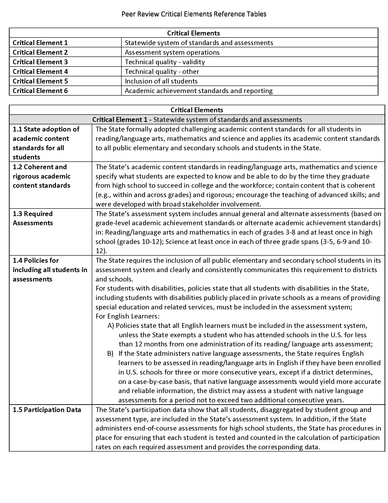

# Introduction {#intro}
It is the policy of the State Board of Education and a priority of the Virginia
Department of Education that there will be no discrimination or harassment on
the grounds of race, color, religion, sex, sexual orientation, national origin,
age or disability in any educational programs, activities or employment. Persons
having questions about equal opportunity and nondiscrimination should contact
the Deputy Superintendent of Public Instruction with the Virginia Department of
Education.
*This technical report is one of a series that describes the development of
Virginia's Statewide Assessment System. The complete set of volumes provides
comprehensive documentation of the development, procedures, technical adequacy,
and results of the system.

\newpage


\newpage


\newpage


\newpage


\newpage


\newpage


\newpage


You can label chapter and section titles using `{#label}` after them, e.g., we can reference Chapter \@ref(intro). If you do not manually label them, there will be automatic labels anyway, e.g., Chapter \@ref(methods).
```{r}
#bookdown::render_book("index.Rmd")
```

Figures and tables with captions will be placed in `figure` and `table` environments, respectively.

```{r nice-fig, fig.cap='Here is a nice figure!', out.width='80%', fig.asp=.75, fig.align='center'}
par(mar = c(4, 4, .1, .1))
plot(pressure, type = 'b', pch = 19)
```

Reference a figure by its code chunk label with the `fig:` prefix, e.g., see Figure \@ref(fig:nice-fig). Similarly, you can reference tables generated from `knitr::kable()`, e.g., see Table \@ref(tab:nice-tab).

```{r nice-tab, tidy=FALSE}
knitr::kable(
  head(iris, 20), caption = 'Here is a nice table!',
  booktabs = TRUE
)
```

You can write citations, too. For example, we are using the **bookdown** package [@R-bookdown] in this sample book, which was built on top of R Markdown and **knitr** [@xie2015].


